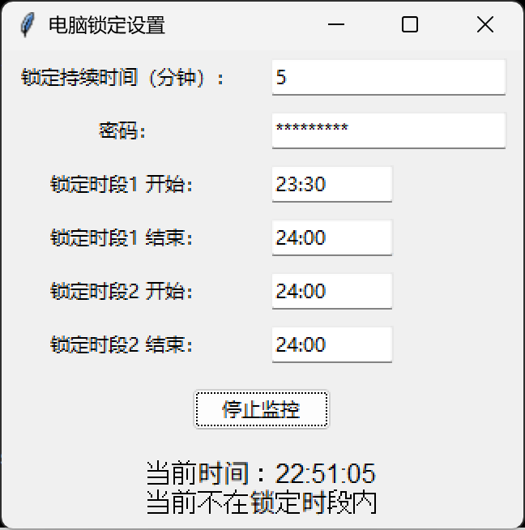
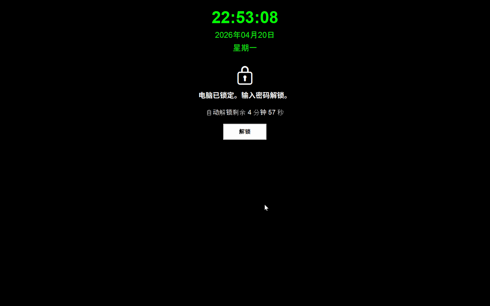

# Computer Lock

一个用于监控计算机使用时间并在超过阈值时自动锁定的Python应用程序。

A Python application that monitors computer usage time and automatically locks the computer when the threshold is exceeded.

## 功能特性 / Features

- **使用时间监控** / **Usage Time Monitoring**: 监控连续使用时间或基于输入活动的使用时间。
- **自动锁定** / **Auto Lock**: 当使用时间超过设置的阈值时，自动锁定计算机。
- **密码解锁** / **Password Unlock**: 使用密码解锁计算机。
- **定时解锁** / **Timed Unlock**: 设置锁定持续时间，时间到自动解锁。
- **GUI设置界面** / **GUI Settings Interface**: 易用的图形界面进行配置。
- **连续模式** / **Continuous Mode**: 忽略输入活动，持续计数使用时间。

## 安装 / Installation

1. 确保安装了Python 3.x。
2. 下载或克隆此仓库。
3. 运行 `computer_lock.py`。

Ensure Python 3.x is installed.
Download or clone this repository.
Run `computer_lock.py`.

## 使用 / Usage

1. 运行脚本后，会弹出设置界面。
2. 配置使用阈值（分钟）、锁定持续时间（分钟）和密码。
3. 选择是否启用连续模式。
4. 点击“开始监控”按钮。
5. 应用程序会最小化到任务栏，开始监控。

Run the script, configure settings in the GUI, and start monitoring.

## 配置 / Configuration

配置保存在 `config.json` 文件中：

- `usage_threshold`: 使用阈值（分钟）
- `lock_duration`: 锁定持续时间（分钟）
- `password`: 解锁密码
- `continuous_mode`: 是否启用连续模式

Configuration is saved in `config.json`:

- `usage_threshold`: Usage threshold (minutes)
- `lock_duration`: Lock duration (minutes)
- `password`: Unlock password
- `continuous_mode`: Enable continuous mode

## 截图 / Screenshots

### 设置界面 / Settings Interface

### 锁定屏幕 / Lock Screen

## 注意事项 / Notes

- 此应用程序仅适用于Windows系统。
- 确保密码安全，不要遗忘。
- 锁定期间，计算机将显示全屏锁定窗口。

This application is for Windows only.
Keep your password secure.
During lock, a full-screen lock window will be displayed.

## 许可证 / License

MIT License